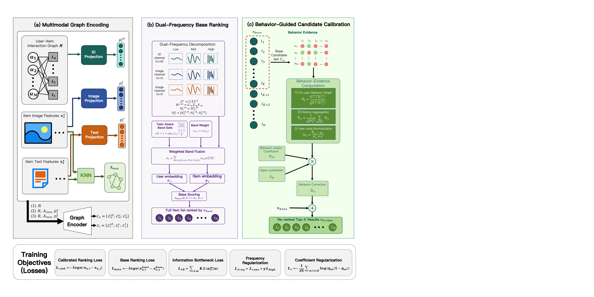

# BRIDGE

**English** | [简体中文](README_zh-CN.md)

**CIKM 2026 · Full Research Paper**

> **Official PyTorch implementation of the CIKM 2026 paper
> [BRIDGE: Behavior-Guided Residual Integration with Dual-Frequency Graph Evidence](https://doi.org/10.1145/3799682.3840961).**

Zesheng Li, Chengchang Pan, and Honggang Qi<br>
University of the Chinese Academy of Sciences

[Paper (ACM DL)](https://doi.org/10.1145/3799682.3840961) | [PDF](docs/assets/bridge-paper.pdf) | [Project Page](https://lizesheng13.github.io/bridge/) | [Model Code](src/models/bridge.py)

## Overview

Multimodal recommendation benefits from visual and textual content, but stronger
cross-view alignment does not always produce better rankings. BRIDGE separates
multimodal representation learning from behavior-guided score correction: the
multimodal backbone retrieves plausible items, while behavior evidence only
calibrates their local order inside the base top-*K* candidate set.

BRIDGE contains three main components:

- **DFGE** decomposes graph-smoothed ID, visual, and textual representations into
  frequency bands while preserving both shared structure and private ranking
  signals.
- **BEN** converts training-only co-user overlap into signed behavior evidence.
- **CRI** applies the behavior-guided residual only within the base candidate set
  during both training and inference.

## Framework



## Main Results

BRIDGE is evaluated with full-sort ranking on three Amazon datasets. The reported
results are averaged over five random seeds.

| Dataset | Recall@20 | NDCG@20 |
| --- | ---: | ---: |
| Baby | **0.1128** | **0.0525** |
| Sports | **0.1262** | **0.0594** |
| Electronics | **0.0778** | **0.0385** |

## Repository Structure

```text
BRIDGE-release/
├── docs/                 # Project page, figures, and paper PDF
├── scripts/              # Reproduction scripts for the three datasets
├── src/
│   ├── configs/          # Dataset and model configurations
│   ├── models/           # BRIDGE and the dual-frequency encoder
│   ├── common/           # Training framework and losses
│   ├── utils/            # Data loading and evaluation utilities
│   └── main.py           # Training entry point
├── environment.yaml      # Reference Conda environment
├── requirements.txt      # Python dependency list
└── LICENSE
```

## Environment

The reference environment uses Python 3.10, PyTorch 2.1.2 with CUDA 12.1, and
PyTorch Geometric 2.7.0. Create it with:

```bash
conda env create -f environment.yaml
conda activate bridge
```

If PyTorch and PyTorch Geometric are already installed for your CUDA version,
the remaining packages are listed in `requirements.txt`.

## Data Preparation

Dataset files are not distributed in this repository. Organize the processed
datasets as follows:

Download the processed datasets from [Quark Drive](https://pan.quark.cn/s/ab2edddf790c).

```text
data/
├── baby/
│   ├── baby.inter
│   ├── image_feat.npy
│   └── text_feat.npy
├── sports/
│   ├── sports.inter
│   ├── image_feat.npy
│   └── text_feat.npy
└── elec/
    ├── elec.inter
    ├── image_feat.npy
    └── text_feat.npy
```

Each interaction file is tab-separated and contains the following columns:

| Column | Description |
| --- | --- |
| `userID` | Integer user identifier |
| `itemID` | Integer item identifier |
| `x_label` | Split label: `0` for training, `1` for validation, and `2` for testing |

Rows in `image_feat.npy` and `text_feat.npy` must follow the encoded `itemID`
order. `user_emb.npy` and `user_graph_dict.npy` are optional artifacts for a
legacy user-graph branch; neither file is required by the default BRIDGE
configuration.

You may also point `data` to a local dataset directory with a symbolic link.
Machine-specific data paths should not be committed.

## Training and Evaluation

Run an experiment from the repository root:

```bash
# Amazon Baby
GPU_ID=0 SEED=2020 bash scripts/run_bridge_baby.sh

# Amazon Sports
GPU_ID=0 SEED=2020 bash scripts/run_bridge_sports.sh

# Amazon Electronics
GPU_ID=0 SEED=2020 bash scripts/run_bridge_elec.sh
```

To use a specific Python executable:

```bash
PYTHON_BIN=/path/to/python GPU_ID=0 SEED=2020 bash scripts/run_bridge_baby.sh
```

The entry point can also be called directly:

```bash
cd src
python main.py --model BRIDGE --dataset baby --gpu_id 0 --seed 2020
```

Model hyperparameters are defined in
[`src/configs/model/BRIDGE.yaml`](src/configs/model/BRIDGE.yaml), and dataset
settings are stored in [`src/configs/dataset/`](src/configs/dataset/).

## Citation

If this repository is useful for your research, please cite:

```bibtex
@inproceedings{li2026bridge,
  author    = {Li, Zesheng and Pan, Chengchang and Qi, Honggang},
  title     = {BRIDGE: Behavior-Guided Residual Integration with Dual-Frequency Graph Evidence},
  booktitle = {Proceedings of the 35th ACM International Conference on Information and Knowledge Management},
  year      = {2026},
  publisher = {ACM},
  doi       = {10.1145/3799682.3840961},
  isbn      = {979-8-4007-2539-5/2026/11}
}
```

## License

The code is released under the [GNU General Public License v3.0](LICENSE).
